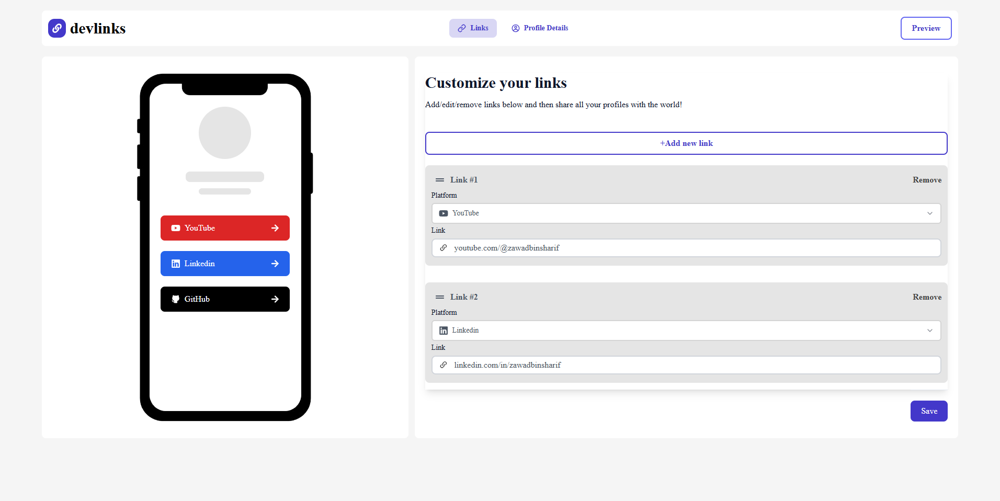
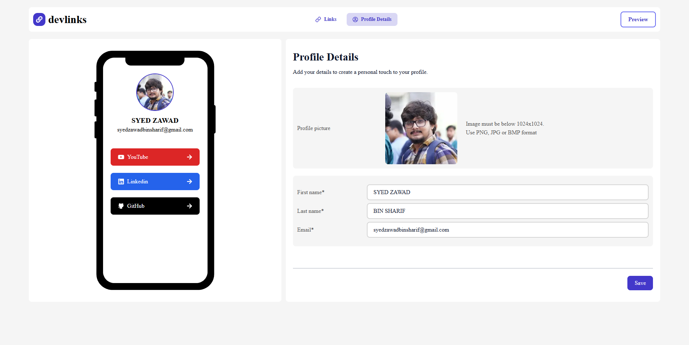
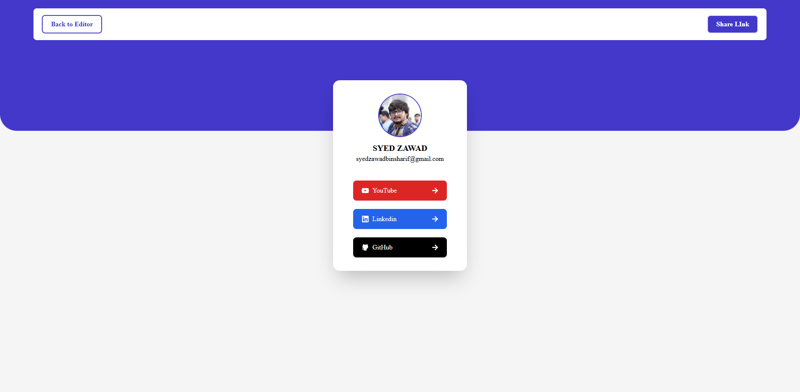
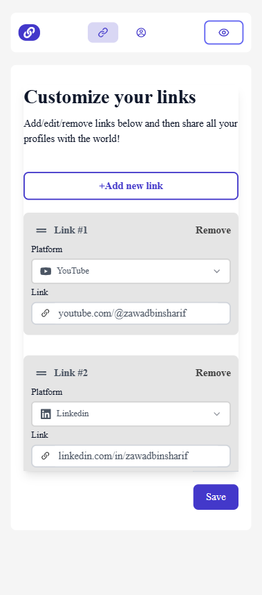
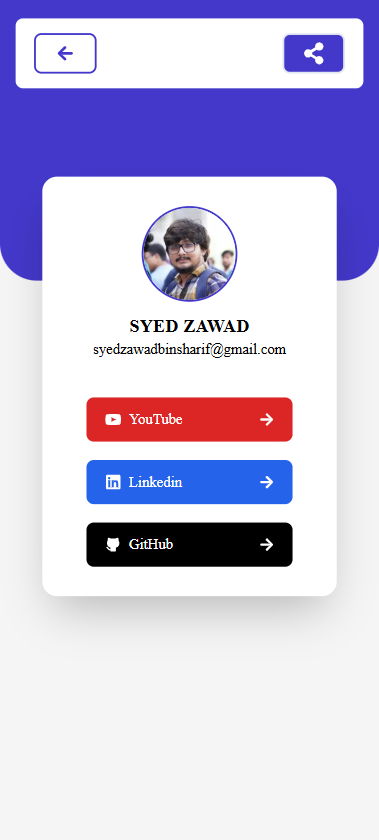
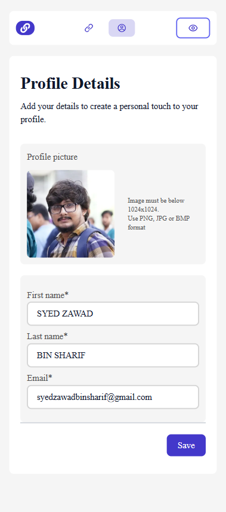

## Short list
- [Short list](#short-list)
- [How to setup and start the project](#how-to-setup-and-start-the-project)
- [Video of the website](#video-of-the-website)
- [Images of website](#images-of-website)


## How to setup and start the project
After downloading github files, goto the project folder and run a command for install all package:

```bash
npm i
```

Now, run the development server:
```bash
npm run dev
```

<b>Open [http://localhost:3000](http://localhost:3000) with your browser to see the result.</b>


## Video of the website


## Images of website





